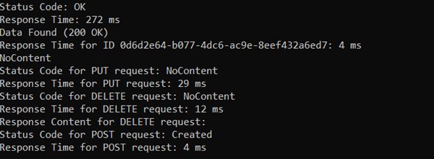
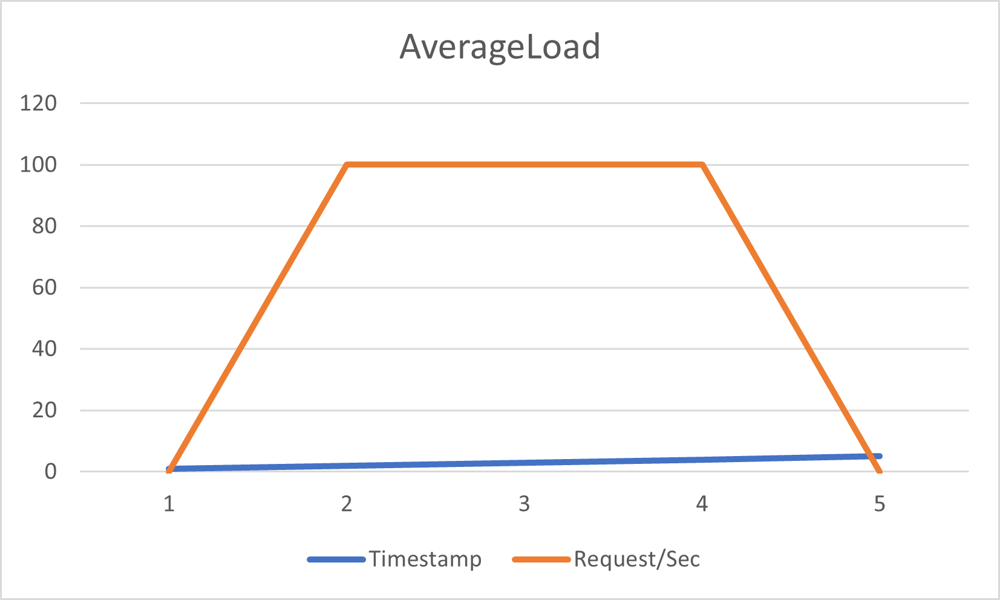
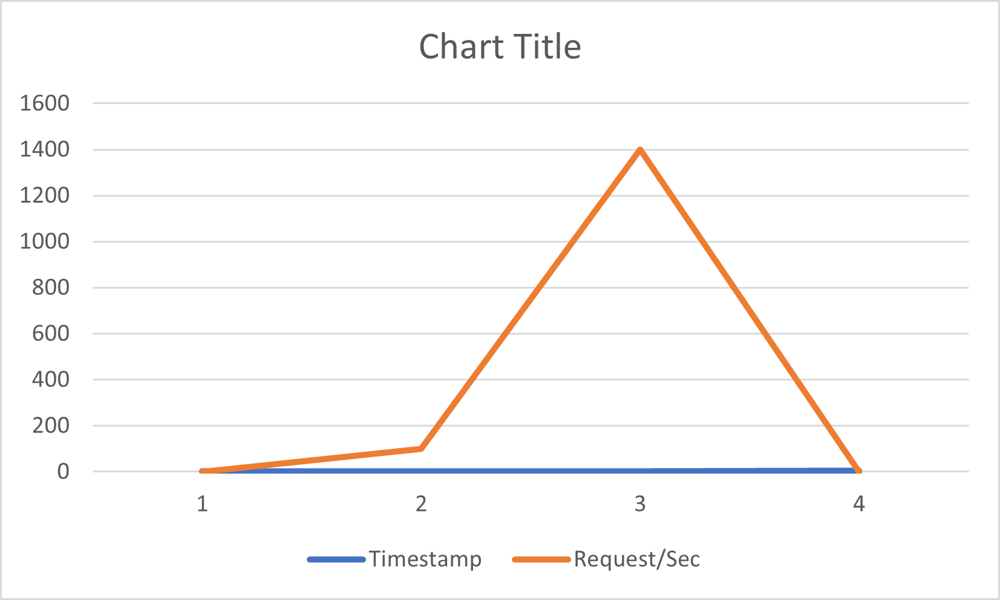

# CIRSAHackathonBackend


# API Testing Utility

This utility is designed for testing different types of loads on an API endpoint. It supports smoke tests, average load tests, and spike tests.

## Requirements
- .NET Core
- Newtonsoft.Json
- System.Text.Json

## Setup
Modify the `apiEndpoint` variable in the `Program` class to point to your API endpoint.

## Usage
Run the program and choose the type of test you want to perform:
1. Smoke Tests
2. Average Load Tests
3. Spike Tests

Enter the corresponding number to execute the desired test.

## Test Types
- **Smoke Tests:** Basic tests to check if the API is working.
- **Average Load Tests:** Simulates a normal load on the API over a specified duration.
- **Spike Tests:** Tests the API's response to sudden spikes in load.

## Test Methods
- `RunSmokeTests()`: Performs smoke tests.
- `RunAverageLoadTests()`: Performs average load tests.
- `RunSpikeTests()`: Performs spike tests (to be implemented).

## Customizing Tests
You can customize the tests by modifying the parameters passed to the test methods in `Program.cs`.

### Example Test Data
```csharp
new GameData
{
    GameName = "Sic Bo",
    Category = "Dice Game",
    TotalBets = 6000,
    TotalWins = 3000,
    AverageBetAmount = 5,
    PopularityScore = 5.8,
    LastUpdated = "2023-11-26T17:30:57.502414Z"
}
```

## Additional Information
- Ensure your API endpoint is correctly set up and accessible.

## Smoke Test Results
Below is a sample output from running smoke tests:


Below are the results of the Average Load Test:




Below are the results of SpikeTest:



## Note
- During the multiuser load for the Average and Spike test the IDs and Data used are not changed.
- 


